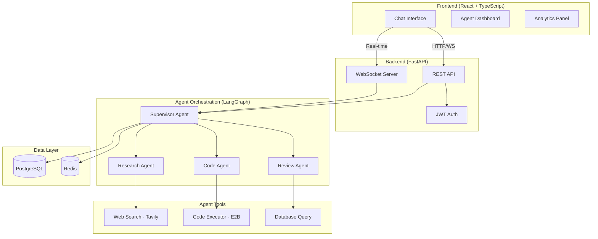

# 🤖 AgentFlow — Multi-Agent AI Assistant Platform

[](https://github.com/yourusername/multi-agent-platform/actions)
[](https://python.org)
[](https://react.dev)
[](https://fastapi.tiangolo.com)
[](https://langchain-ai.github.io/langgraph/)
[](https://docker.com)
[](LICENSE)

A **production-grade platform** where multiple AI agents collaborate autonomously to complete complex tasks. A Supervisor agent orchestrates specialized agents (Researcher, Coder, Reviewer) that use tools, share context, and stream their progress in real-time to a React dashboard.

---

## ✨ Features

- 🎯 **Multi-Agent Orchestration** — Supervisor routes tasks to specialized agents using deterministic state machines
- 🔍 **Research Agent** — Web search with Tavily API, structured reports with citations
- 💻 **Code Agent** — Writes and executes Python/JS in E2B sandboxes
- ✅ **Review Agent** — Quality assurance with approval/revision workflow
- ⚡ **Real-Time Streaming** — WebSocket-powered live agent activity via Redis pub/sub
- 🔐 **JWT Authentication** — Secure stateless auth with access + refresh tokens
- 📊 **Analytics Dashboard** — Token usage, costs, latency metrics with Recharts
- 🛡️ **Guardrails** — Prompt injection detection, PII redaction, token budget limits
- 📋 **Task History** — Full audit trail with search and filtering
- 🌙 **Dark/Light Theme** — Premium glassmorphic UI with Framer Motion animations
- 🐳 **Docker Compose** — One command to run the entire stack
- 📡 **Observability** — Langfuse integration for LLM call tracing

---

## 🏗️ Architecture



---

## 🛠️ Tech Stack

| Layer | Technology | Why |
|-------|-----------|-----|
| **Frontend** | React 18, TypeScript, Vite | Industry standard, type safety |
| **Styling** | CSS Variables + Framer Motion | Premium UI with animations |
| **State** | Zustand | Lightweight, modern state management |
| **Backend** | FastAPI, Uvicorn, Python 3.11+ | Async-first, perfect for AI workloads |
| **Agents** | LangGraph | Production-grade state machines |
| **LLM** | OpenAI GPT-4o / GPT-4o-mini | Cost-optimized model selection |
| **Tools** | Tavily, E2B | Real tool-use with fallback mocks |
| **Queue** | Redis + Celery | Async execution, prevents timeouts |
| **Database** | PostgreSQL | Users, sessions, audit logs |
| **Cache** | Redis | Agent state, pub/sub streaming |
| **Auth** | JWT | Stateless authentication |
| **DevOps** | Docker Compose, GitHub Actions | Containerized + CI/CD |
| **Observability** | Langfuse | Trace agent steps and token costs |

---

## 🚀 Quick Start

### Prerequisites
- Docker & Docker Compose
- API keys (optional — works with mock tools)

### 1. Clone & Configure
```bash
git clone https://github.com/yourusername/multi-agent-platform.git
cd multi-agent-platform
cp .env.example .env
# Edit .env with your API keys (optional)
```

### 2. Start Everything
```bash
docker compose up --build
```

### 3. Access the Platform
- **Frontend:** http://localhost:3000
- **Backend API:** http://localhost:8000
- **API Docs:** http://localhost:8000/docs
- **Langfuse:** http://localhost:3001

---

## 📁 Project Structure

```
multi-agent-platform/
├── docker-compose.yml          # Full stack orchestration
├── .env.example                # Environment template
├── backend/
│   ├── app/
│   │   ├── main.py             # FastAPI entry point
│   │   ├── config.py           # Pydantic settings
│   │   ├── api/                # REST routes & WebSocket
│   │   ├── agents/             # LangGraph state machine
│   │   ├── tools/              # Agent tools (search, code exec)
│   │   ├── models/             # SQLAlchemy models
│   │   ├── schemas/            # Pydantic schemas
│   │   ├── services/           # Business logic
│   │   ├── guardrails/         # Safety & validation
│   │   └── workers/            # Celery task workers
│   └── tests/
├── frontend/
│   ├── src/
│   │   ├── pages/              # Chat, History, Analytics, Settings
│   │   ├── components/         # Reusable UI components
│   │   ├── stores/             # Zustand state management
│   │   ├── hooks/              # Custom React hooks
│   │   └── services/           # API client
│   └── index.html
└── .github/workflows/          # CI/CD pipelines
```

---

## 🎯 Design Decisions

| Decision | Rationale |
|----------|-----------|
| **LangGraph over CrewAI** | Deterministic state machines > autonomous agent loops. Better for production reliability and debugging. |
| **Celery + Redis** | Prevents HTTP timeouts for long-running agent tasks. Enables real-time streaming via pub/sub. |
| **Deterministic Routing** | Supervisor uses keyword analysis instead of LLM-driven routing — faster, cheaper, more predictable. |
| **Mock Fallbacks** | Every tool has a mock implementation so the platform works without API keys for demos. |
| **Glassmorphic UI** | Modern, premium aesthetic that stands out in a portfolio. |

---

## 📄 API Documentation

FastAPI auto-generates interactive API docs at `/docs` (Swagger) and `/redoc`.

### Key Endpoints

| Method | Endpoint | Description |
|--------|----------|-------------|
| `POST` | `/api/auth/register` | User registration |
| `POST` | `/api/auth/login` | Login → JWT tokens |
| `POST` | `/api/tasks` | Submit agent task |
| `GET` | `/api/tasks/{id}` | Get task status |
| `GET` | `/api/tasks` | List task history |
| `DELETE` | `/api/tasks/{id}` | Cancel task |
| `WS` | `/ws/tasks/{id}` | Real-time events |
| `GET` | `/api/analytics` | Usage stats |
| `GET` | `/api/health` | Health check |

---

## 🧪 Testing

```bash
# Backend tests
cd backend && pip install -e ".[dev]" && pytest tests/ -v

# Frontend type check
cd frontend && npx tsc --noEmit

# Build check
cd frontend && npm run build
```

---

## 📜 License

MIT License — see [LICENSE](LICENSE) for details.

---

Built with ❤️ as a demonstration of production-grade AI engineering.
